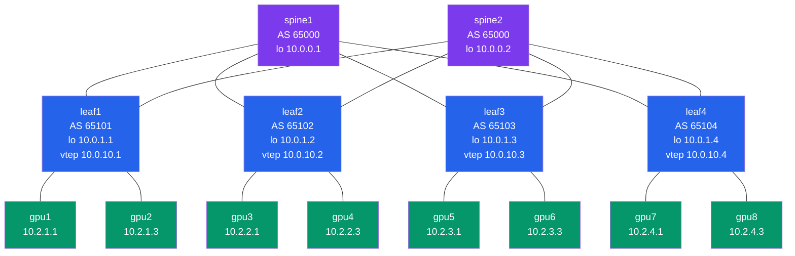

# Lab Topology

Where every device, link, and IP lives. Keep this open in a tab while you're at a switch CLI — when you see an IP in `show bgp summary`, this doc tells you what link it belongs to.

- 14 containers total: **2 spines + 4 leaves + 8 GPU workers**
- 16 links total: 8 spine↔leaf + 8 leaf↔worker
- Pure CLOS, non-blocking (2 worker links : 2 fabric links per leaf)
- Every leaf has one link to every spine (full bipartite)
- Runs on **`aidc-remote` (192.168.1.26)**, Ubuntu 20.04 amd64

---

## 1. The picture

```
                        AS 65000 (both spines share an ASN)
                  ┌────────────────────────────────────────────┐
                  │                                            │
              ┌───┴────┐                                  ┌────┴───┐
              │ spine1 │                                  │ spine2 │
              │10.0.0.1│                                  │10.0.0.2│
              └─┬─┬─┬─┬┘                                  └┬─┬─┬─┬─┘
                │ │ │ │      ┌──────────────────────────┐  │ │ │ │
                │ │ │ │      │  full bipartite          │  │ │ │ │
                │ │ │ │      │  every leaf has 1 link   │  │ │ │ │
                │ │ │ │      │  to EACH spine           │  │ │ │ │
                │ │ │ │      └──────────────────────────┘  │ │ │ │
                │ │ │ │                                    │ │ │ │
        ┌───────┘ │ │ └─────────┐                  ┌───────┘ │ │ └─────────┐
        │   ┌─────┘ └──────┐    │                  │   ┌─────┘ └──────┐    │
        │   │              │    │                  │   │              │    │
     ┌──┴──┴─┐  ┌───┴──┴──┐ ┌───┴──┴──┐  ┌────┴──┴────┐
     │ leaf1 │  │  leaf2  │ │  leaf3  │  │   leaf4    │
     │AS65101│  │ AS65102 │ │ AS65103 │  │  AS65104   │
     │10.0.1.1│ │10.0.1.2 │ │10.0.1.3 │  │ 10.0.1.4   │
     └─┬───┬─┘  └─┬─────┬─┘ └─┬─────┬─┘  └──┬──────┬──┘
       │   │      │     │     │     │       │      │
     gpu1 gpu2  gpu3   gpu4 gpu5   gpu6   gpu7    gpu8
```

Rendered Mermaid version (VSCode shows this with the Markdown Preview Mermaid Support extension):



---

## 2. Addressing scheme (rules)

| Purpose | Pattern | Block |
|---|---|---|
| Spine loopback | `10.0.0.<spine_id>/32` | `10.0.0.0/24` |
| Leaf loopback | `10.0.1.<leaf_id>/32` | `10.0.1.0/24` |
| Worker "host" /32 (on `lo`) | `10.0.2.<worker_id>/32` | `10.0.2.0/24` |
| Leaf VTEP (Phase 3) | `10.0.10.<leaf_id>/32` | `10.0.10.0/24` |
| Spine ↔ Leaf /31 | `10.1.<spine_id>.<2*leaf_id-2>/31`<br/>spine end = even, leaf end = odd | `10.1.0.0/16` |
| Leaf ↔ Worker /31 | `10.2.<leaf_id>.<2*local_idx>/31`<br/>leaf end = even, worker end = odd | `10.2.0.0/16` |
| Container management | DHCP from containerlab `aidc-mgmt` | `172.20.20.0/24` |
| GPU overlay subnet (Phase 3) | stretched L2 via EVPN VNI 10100 | `192.168.100.0/24` |

`local_idx` for workers = 0 or 1 (each leaf has 2 workers; the lower-numbered worker is idx 0).

So for leaf2 ↔ gpu4: leaf_id=2, local_idx=1 → `10.2.2.<2*1>/31` = `10.2.2.2/31`. Leaf end = `10.2.2.2`, gpu4 end = `10.2.2.3`. (Worker IDs are global 1–8; local_idx within the leaf is `(worker_id − 1) % 2`.)

---

## 3. Per-device factsheets

Each block contains everything you need to think about that device: ASN, loopbacks, mgmt IP, and the full interface table (what's on each `ethN`, what IP it has, and the peer's IP).

### Spines

```
spine1   sonic-vs   AS 65000     mgmt 172.20.20.11
  Loopback0  10.0.0.1/32
  Interface  Iface  IP            Peer (name / IP)
  ─────────────────────────────────────────────────
  to_leaf1   eth1   10.1.1.0/31   leaf1  10.1.1.1
  to_leaf2   eth2   10.1.1.2/31   leaf2  10.1.1.3
  to_leaf3   eth3   10.1.1.4/31   leaf3  10.1.1.5
  to_leaf4   eth4   10.1.1.6/31   leaf4  10.1.1.7
```

```
spine2   sonic-vs   AS 65000     mgmt 172.20.20.12
  Loopback0  10.0.0.2/32
  Interface  Iface  IP            Peer (name / IP)
  ─────────────────────────────────────────────────
  to_leaf1   eth1   10.1.2.0/31   leaf1  10.1.2.1
  to_leaf2   eth2   10.1.2.2/31   leaf2  10.1.2.3
  to_leaf3   eth3   10.1.2.4/31   leaf3  10.1.2.5
  to_leaf4   eth4   10.1.2.6/31   leaf4  10.1.2.7
```

### Leaves

```
leaf1    sonic-vs   AS 65101     mgmt 172.20.20.21
  Loopback0  10.0.1.1/32
  Loopback1  10.0.10.1/32        (VTEP, used in Phase 3)
  Interface  Iface  IP            Peer (name / IP)
  ─────────────────────────────────────────────────
  to_spine1  eth1   10.1.1.1/31   spine1 10.1.1.0
  to_spine2  eth2   10.1.2.1/31   spine2 10.1.2.0
  to_gpu1    eth3   10.2.1.0/31   gpu1   10.2.1.1
  to_gpu2    eth4   10.2.1.2/31   gpu2   10.2.1.3
```

```
leaf2    sonic-vs   AS 65102     mgmt 172.20.20.22
  Loopback0  10.0.1.2/32
  Loopback1  10.0.10.2/32        (VTEP, used in Phase 3)
  Interface  Iface  IP            Peer (name / IP)
  ─────────────────────────────────────────────────
  to_spine1  eth1   10.1.1.3/31   spine1 10.1.1.2
  to_spine2  eth2   10.1.2.3/31   spine2 10.1.2.2
  to_gpu3    eth3   10.2.2.0/31   gpu3   10.2.2.1
  to_gpu4    eth4   10.2.2.2/31   gpu4   10.2.2.3
```

```
leaf3    sonic-vs   AS 65103     mgmt 172.20.20.23
  Loopback0  10.0.1.3/32
  Loopback1  10.0.10.3/32        (VTEP, used in Phase 3)
  Interface  Iface  IP            Peer (name / IP)
  ─────────────────────────────────────────────────
  to_spine1  eth1   10.1.1.5/31   spine1 10.1.1.4
  to_spine2  eth2   10.1.2.5/31   spine2 10.1.2.4
  to_gpu5    eth3   10.2.3.0/31   gpu5   10.2.3.1
  to_gpu6    eth4   10.2.3.2/31   gpu6   10.2.3.3
```

```
leaf4    sonic-vs   AS 65104     mgmt 172.20.20.24
  Loopback0  10.0.1.4/32
  Loopback1  10.0.10.4/32        (VTEP, used in Phase 3)
  Interface  Iface  IP            Peer (name / IP)
  ─────────────────────────────────────────────────
  to_spine1  eth1   10.1.1.7/31   spine1 10.1.1.6
  to_spine2  eth2   10.1.2.7/31   spine2 10.1.2.6
  to_gpu7    eth3   10.2.4.0/31   gpu7   10.2.4.1
  to_gpu8    eth4   10.2.4.2/31   gpu8   10.2.4.3
```

### GPU workers

Workers don't run BGP. They have one fabric link (eth1) to their leaf, plus a `lo` /32 for identity.

```
node   mgmt IP        leaf    fabric iface  fabric IP    default via    lo /32
─────  ─────────────  ──────  ────────────  ───────────  ─────────────  ───────────
gpu1   172.20.20.101  leaf1   eth1          10.2.1.1/31  10.2.1.0       10.0.2.1/32
gpu2   172.20.20.102  leaf1   eth1          10.2.1.3/31  10.2.1.2       10.0.2.2/32
gpu3   172.20.20.103  leaf2   eth1          10.2.2.1/31  10.2.2.0       10.0.2.3/32
gpu4   172.20.20.104  leaf2   eth1          10.2.2.3/31  10.2.2.2       10.0.2.4/32
gpu5   172.20.20.105  leaf3   eth1          10.2.3.1/31  10.2.3.0       10.0.2.5/32
gpu6   172.20.20.106  leaf3   eth1          10.2.3.3/31  10.2.3.2       10.0.2.6/32
gpu7   172.20.20.107  leaf4   eth1          10.2.4.1/31  10.2.4.0       10.0.2.7/32
gpu8   172.20.20.108  leaf4   eth1          10.2.4.3/31  10.2.4.2       10.0.2.8/32
```

> The worker `lo` /32 is currently advertised by nothing (workers don't run BGP). Reachability between workers uses their `/31` fabric IP, which the leaf does advertise. The `lo` is reserved for a future "GPU IP" identity if we add eBGP-to-the-host or a Tor-MC-LAG style setup.

---

## 4. Link inventory (the 16 links)

Spine ↔ Leaf — every leaf to every spine. Each row is one veth pair.

| # | A endpoint   | A iface | A IP        | /31         | B IP        | B iface | B endpoint  |
|---|--------------|---------|-------------|-------------|-------------|---------|-------------|
| 1 | spine1       | eth1    | 10.1.1.0    | 10.1.1.0/31 | 10.1.1.1    | eth1    | leaf1       |
| 2 | spine1       | eth2    | 10.1.1.2    | 10.1.1.2/31 | 10.1.1.3    | eth1    | leaf2       |
| 3 | spine1       | eth3    | 10.1.1.4    | 10.1.1.4/31 | 10.1.1.5    | eth1    | leaf3       |
| 4 | spine1       | eth4    | 10.1.1.6    | 10.1.1.6/31 | 10.1.1.7    | eth1    | leaf4       |
| 5 | spine2       | eth1    | 10.1.2.0    | 10.1.2.0/31 | 10.1.2.1    | eth2    | leaf1       |
| 6 | spine2       | eth2    | 10.1.2.2    | 10.1.2.2/31 | 10.1.2.3    | eth2    | leaf2       |
| 7 | spine2       | eth3    | 10.1.2.4    | 10.1.2.4/31 | 10.1.2.5    | eth2    | leaf3       |
| 8 | spine2       | eth4    | 10.1.2.6    | 10.1.2.6/31 | 10.1.2.7    | eth2    | leaf4       |

Leaf ↔ Worker — 2 per leaf.

| #  | A endpoint | A iface | A IP        | /31         | B IP        | B iface | B endpoint |
|----|------------|---------|-------------|-------------|-------------|---------|------------|
| 9  | leaf1      | eth3    | 10.2.1.0    | 10.2.1.0/31 | 10.2.1.1    | eth1    | gpu1       |
| 10 | leaf1      | eth4    | 10.2.1.2    | 10.2.1.2/31 | 10.2.1.3    | eth1    | gpu2       |
| 11 | leaf2      | eth3    | 10.2.2.0    | 10.2.2.0/31 | 10.2.2.1    | eth1    | gpu3       |
| 12 | leaf2      | eth4    | 10.2.2.2    | 10.2.2.2/31 | 10.2.2.3    | eth1    | gpu4       |
| 13 | leaf3      | eth3    | 10.2.3.0    | 10.2.3.0/31 | 10.2.3.1    | eth1    | gpu5       |
| 14 | leaf3      | eth4    | 10.2.3.2    | 10.2.3.2/31 | 10.2.3.3    | eth1    | gpu6       |
| 15 | leaf4      | eth3    | 10.2.4.0    | 10.2.4.0/31 | 10.2.4.1    | eth1    | gpu7       |
| 16 | leaf4      | eth4    | 10.2.4.2    | 10.2.4.2/31 | 10.2.4.3    | eth1    | gpu8       |

---

## 5. BGP peer matrix

| From       | To peer (description / ip)        | Remote AS | Peer group |
|------------|-----------------------------------|-----------|------------|
| **spine1** | leaf1 / 10.1.1.1                  | 65101     | LEAVES     |
| spine1     | leaf2 / 10.1.1.3                  | 65102     | LEAVES     |
| spine1     | leaf3 / 10.1.1.5                  | 65103     | LEAVES     |
| spine1     | leaf4 / 10.1.1.7                  | 65104     | LEAVES     |
| **spine2** | leaf1 / 10.1.2.1                  | 65101     | LEAVES     |
| spine2     | leaf2 / 10.1.2.3                  | 65102     | LEAVES     |
| spine2     | leaf3 / 10.1.2.5                  | 65103     | LEAVES     |
| spine2     | leaf4 / 10.1.2.7                  | 65104     | LEAVES     |
| **leaf1**  | spine1 / 10.1.1.0                 | 65000     | SPINES     |
| leaf1      | spine2 / 10.1.2.0                 | 65000     | SPINES     |
| **leaf2**  | spine1 / 10.1.1.2                 | 65000     | SPINES     |
| leaf2      | spine2 / 10.1.2.2                 | 65000     | SPINES     |
| **leaf3**  | spine1 / 10.1.1.4                 | 65000     | SPINES     |
| leaf3      | spine2 / 10.1.2.4                 | 65000     | SPINES     |
| **leaf4**  | spine1 / 10.1.1.6                 | 65000     | SPINES     |
| leaf4      | spine2 / 10.1.2.6                 | 65000     | SPINES     |

Total sessions: **16 unidirectional → 8 BGP peerings, multiplied by 2 (each end)**. Each spine has 4 leaf peers; each leaf has 2 spine peers.

What each peer advertises:

- **Spine** sends: its own loopback (`10.0.0.X/32`), and re-distributes everything it learned from the 3 other leaves (12 prefixes). PfxSnt per leaf-peer ≈ 17.
- **Leaf** sends: its own loopback (`10.0.1.X/32`), its VTEP (`10.0.10.X/32`), and its two worker /31s (`10.2.X.0/31`, `10.2.X.2/31`). PfxSnt per spine-peer = 4.

---

## 6. Tracing a packet

When `gpu1` sends to `gpu8` (10.2.4.3):

```
gpu1                                                          gpu8
 │ src=10.2.1.1 dst=10.2.4.3                         dst=gpu8 │
 │ default via 10.2.1.0 (leaf1's eth3)                        │
 ▼                                                            │
leaf1: ECMP between two paths, hashes 5-tuple                 │
   path A: via 10.1.1.0 (spine1)                              │
   path B: via 10.1.2.0 (spine2)                              │
 ▼                                                            │
spine1 OR spine2: only one path to 10.0.1.4 (leaf4)           │
   via 10.1.1.7 (spine1->leaf4) or 10.1.2.7 (spine2->leaf4)   │
 ▼                                                            │
leaf4: connected route to 10.2.4.2/31                         │
 ▼                                                            │
gpu8 (10.2.4.3)                                               │
```

Each hop decrements TTL by 1, so a healthy gpu1→gpu8 ping shows **ttl=61** at the destination (started at 64, -3 hops via the fabric).

To inspect which spine *your* flow took:

```bash
# in any worker:
traceroute -n -q 1 10.2.4.3        # 4 lines: leaf, spine, leaf, gpu

# in the leaf, force one specific 5-tuple to a spine:
ip route get 10.2.4.3 from 10.2.1.1
```

---

## 7. Management network (out-of-band)

Everything also has a mgmt IP on the containerlab `aidc-mgmt` bridge. This is **not** part of the fabric — it's how the host (and our FastAPI orchestrator) reaches the containers without going through the simulated fabric.

| Device  | Mgmt IP        |
|---------|----------------|
| spine1  | 172.20.20.11   |
| spine2  | 172.20.20.12   |
| leaf1   | 172.20.20.21   |
| leaf2   | 172.20.20.22   |
| leaf3   | 172.20.20.23   |
| leaf4   | 172.20.20.24   |
| gpu1    | 172.20.20.101  |
| gpu2    | 172.20.20.102  |
| gpu3    | 172.20.20.103  |
| gpu4    | 172.20.20.104  |
| gpu5    | 172.20.20.105  |
| gpu6    | 172.20.20.106  |
| gpu7    | 172.20.20.107  |
| gpu8    | 172.20.20.108  |

`eth0` in every container is the mgmt interface; `eth1`..`eth4` are the fabric veths.

---

## 8. Where everything lives

| Thing | Path |
|---|---|
| Topology source of truth | [topo/aidc.clab.yml](../topo/aidc.clab.yml) — containerlab definition (nodes + links) |
| FRR config per switch    | [configs/frr/](../configs/frr/) — one folder per switch |
| Switch bootstrap script  | [configs/frr/bootstrap-switch.sh](../configs/frr/bootstrap-switch.sh) — runs on every switch after deploy |
| Worker image             | [workers/Dockerfile](../workers/Dockerfile) + [workers/entrypoint.sh](../workers/entrypoint.sh) |
| Addressing rationale     | [notes/decisions.md](../notes/decisions.md) — ADR-001/002 (BGP), ADR-005 (overlay plan) |
| Phase 1 demo             | [scenarios/00-bring-up-fabric.md](../scenarios/00-bring-up-fabric.md) |
| CLI cheat sheet          | [docs/switch-cli-reference.md](switch-cli-reference.md) |

---

## 9. Future expansions (Phase 3+)

Where things will *grow* without breaking the addressing scheme:

| Future thing | Reserved address | Notes |
|---|---|---|
| EVPN overlay L2 VNI for GPUs | VNI **10100**, subnet `192.168.100.0/24` | All 8 workers will get an IP in this segment over VXLAN |
| Second tenant overlay (Phase 4) | VNI **10101** L2 + **30001** L3VNI | Multi-tenant demo |
| Mgmt overlay | VNI **10200** | Optional, for orchestrator reachability via overlay |
| Adding a 5th leaf | AS **65105**, lo **10.0.1.5/32**, VTEP **10.0.10.5/32**, p2p to spine1 = `10.1.1.8/31` (spine1 .8, leaf5 .9), p2p to spine2 = `10.1.2.8/31` | Just extend the formula |
| Adding gpu9/gpu10 under leaf5 | gpu9 = `10.2.5.1/31`, gpu10 = `10.2.5.3/31` | Same pattern |
